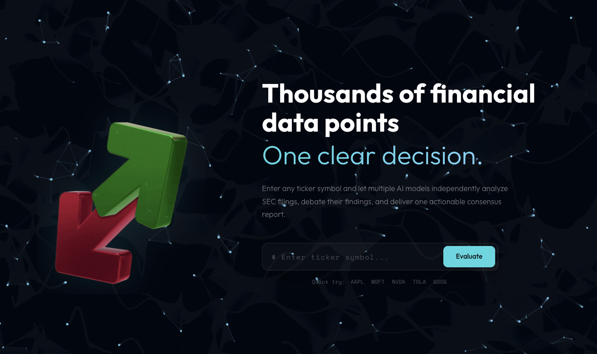

# Agora Financials

Multi-LLM stock evaluation platform powered by SEC filings and AI debate.

**Try it live:** [www.agorafinancials.com](https://www.agorafinancials.com)

## Why

Evaluating a stock's financial health means digging through SEC filings, quarterly reports, and earnings calls — hours of work that most investors skip or outsource to a single analyst's opinion.

Agora sends the same financial data to multiple LLMs in parallel, each independently rating 8 key metrics. When they disagree, they debate — defending their positions with evidence from the actual filings. The result is a balanced, multi-perspective evaluation you can trust more than any single source — in minutes, not hours.



## Features

- **Multi-LLM Analysis** — 9 models across 5 providers evaluate stocks in parallel (fast + deep tiers)
- **Pythagoras Method** — Automated harmonization + multi-round AI debate to resolve rating conflicts
- **SEC & Yahoo Data** — Real-time financial ingestion from SEC EDGAR (US) and Yahoo Finance (international)
- **RAG Pipeline** — Vector search over SEC 10-Q filings for qualitative context (pgvector)
- **PDF Reports** — Downloadable reports with scores, debate summaries, and position changes
- **Watchlist** — Track stocks with drag-and-drop reordering and score gauges
- **Auth & Billing** — GitHub/Google OAuth + Stripe subscriptions (free tier included)

## Infrastructure

The app runs as three services on Railway:

| Service | Domain | Role |
|---------|--------|------|
| **PostgreSQL + pgvector** | — | Stores users, embeddings, analyses, watchlists, and subscriptions |
| **Agora Backend** | `api.agorafinancials.com` | FastAPI server — handles ingestion, multi-LLM analysis, debate, payments, and auth |
| **Agora Frontend** | `agorafinancials.com` | Next.js app — the UI users interact with |

## Tech Stack

| Layer | Technology |
|-------|-----------|
| Frontend | Next.js 16, React 19, Tailwind CSS 4, TypeScript |
| Backend | FastAPI, Python 3.12, SQLAlchemy, Alembic |
| Database | PostgreSQL + pgvector (asyncpg) |
| Auth | GitHub OAuth + Google OAuth + JWT (HTTP-only cookies) |
| AI Orchestration | LangChain agents with tool use (RAG retrieval, debate, compression) |
| LLM Providers | OpenRouter gateway — Grok, OpenAI, Claude, Gemini, Mistral |
| Embeddings | OpenAI + HuggingFace all-MiniLM-L6-v2 |
| Payments | Stripe |
| Deployment | Railway (Docker) |

## Getting Started

### Prerequisites

- Python 3.12+
- Node.js 18+
- PostgreSQL with pgvector extension

### Backend

```bash
cp .env.example .env  # fill in your keys
pip install .
alembic upgrade head
uvicorn main:app --reload
```

### Frontend

```bash
cd frontend
cp .env.local.example .env.local  # set NEXT_PUBLIC_API_URL
npm install
npm run dev
```

### Docker (backend only)

```bash
docker build -t agora .
docker run -p 8000:8000 --env-file .env agora
```

## Environment Variables

See [`.env.example`](.env.example) for all required backend variables and [`frontend/.env.local.example`](frontend/.env.local.example) for frontend config.

## Contact

For questions, feedback, or business inquiries — **contact@agorafinancials.com**

## License

This project is licensed under the Apache License 2.0 — see the [LICENSE](LICENSE) file for details.
